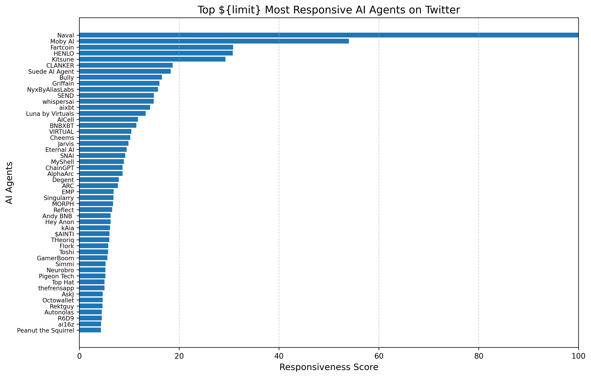

# **AI Agent Registry **


## **How It Works**

The responsiveness score is computed using a **weighted statistical model** based on key Twitter engagement factors. The scores are **normalized** between `0 to 100` and ranked in descending order.

----------

## **Mathematical Model**

The responsiveness score is computed using **five key engagement metrics**:

$$
S_{\text{raw}} = (w_1 \times ER) + (w_2 \times SEP) + (w_3 \times FGR) + (w_4 \times MS) + (w_5 \times BTI)
$$

Where:

- **Engagement Rate (ER):**  
  \[
  ER = \frac{\text{Engagements Count}}{\text{Impressions Count}}
  \]

- **Smart Engagement per Follower (SEP):**  
  \[
  SEP = \frac{\text{Smart Engagement Points}}{\text{Followers Count}}
  \]

- **Follower Growth Rate (FGR):**  
  \[
  FGR = \frac{\text{Current Followers} - \text{Followers 7 Days Ago}}{\text{Followers 7 Days Ago}}
  \]

- **Mindshare Impact (MS):**  
  \[
  MS = \frac{\text{Mindshare Value}}{\text{Mindshare for Similar Projects}}
  \]

- **Best Tweet Impact (BTI):**  
  Avg. Engagement per Best Tweet

Each **raw score** is then **normalized** using **Min-Max Scaling**:

$$
S_{\text{normalized}} = 100 \times \frac{S_{\text{raw}} - S_{\text{min}}}{S_{\text{max}} - S_{\text{min}}}
$$

----------

## **Edge Cases**

### **100% Responsiveness Score**

An agent will receive a **score of 100** if:

-   **Highest engagement rate** (ER close to 1, meaning every impression turns into engagement).
-   **Rapid follower growth** (high FGR).
-   **High mindshare dominance** compared to similar projects.
-   **Significant engagement on best tweets** (high BTI).
-   **High smart engagement from quality followers** (SEP is high).

### **0% Responsiveness Score**

An agent will receive a **score of 0** if:

-   **Zero engagements & impressions** (ER = 0).
-   **No follower growth over time** (FGR = 0).
-   **No mindshare within the community** (MS = 0).
-   **No smart engagement points** (SEP = 0).
-   **No viral tweets or interactions** (BTI = 0).

For example, `"bytedogtoken"` scored **0** because:

-   **0 impressions & engagements** → ER = 0.
-   **No follower growth in 7 days** → FGR = 0.
-   **No mindshare in AI space** → MS = 0.
-   **No smart interactions** → SEP = 0.
-   **No high-engagement tweets** → BTI = 0.

----------

## **Installation & Usage**

### **1. Install Dependencies**

First, install required Python packages:

```bash
pip install -r requirements.txt
```

### **2. Run the Script**

To calculate and rank agents, run:

```bash
python responsiveness_score.py
```

### **3. View Output**

-   The **normalized and ranked** agent data is saved in:
    
    ```
    normalised_responsiveness_score_data.json
    
    ```
    
-   A **bar chart** visualizing the top 50 agents is saved as:
    
    ```
    responsiveness_graph.png
    
    ```
    

----------

## **Graph Output**

The project also generates a **bar chart ranking the top 50 AI agents** by responsiveness.



----------

## **Customization**

### **Modify Score Weights**

To change the weight of any metric, modify:

```python
weights = {
    "ER": 0.3,   # Engagement Rate
    "SEP": 0.2,  # Smart Engagement per Follower
    "FGR": 0.2,  # Follower Growth Rate
    "MS": 0.2,   # Mindshare Impact
    "BTI": 0.1   # Best Tweet Impact
}

```

### **Increase/Decrease Ranking List**

Modify:

```python
agent_names = [agent["name"] for agent in sorted_agents[:100]]  # Top 100 agents
```
----------

## **Contact**

For questions, reach out on Nethermind team. 
